# Results

All numbers are on the **held-out test set** — 19,773 encounters from 13,998
patients who appear nowhere in training or validation. Base rate 11.35%.

Reproduce with `make train`. Raw values in
[`reports/metrics.json`](../reports/metrics.json).

---

## Headline

| metric | value | 95% CI | no-skill reference |
|---|---|---|---|
| **PR-AUC** | **0.238** | [0.213, 0.265] | 0.113 (base rate) |
| **ROC-AUC** | **0.684** | [0.671, 0.698] | 0.500 |
| **Brier** | **0.095** | [0.092, 0.099] | 0.101 |
| Recall @ 20% capacity | **40.2%** | [37.6%, 42.7%] | 20% |
| Precision @ 20% capacity | **23.3%** | [21.8%, 24.9%] | 11.3% |
| Lift over base rate | **2.05×** | — | 1.00× |

Calling the 20% of discharges the model ranks highest catches **40.2% of all
30-day readmissions**. A flagged patient is **2.05× more likely** to return than
an average one.

Intervals are 95% cluster bootstrap (2,000 resamples of *patients*, not rows —
see [Uncertainty](#uncertainty)).

> **Read this alongside the seed sweep.** The numbers above come from the single
> split fixed by `random_state=42`. Across seven random splits the same pipeline
> averages **ROC-AUC 0.678 ± 0.006** and **PR-AUC 0.224 ± 0.010** — seed 42 turns
> out to be the most favourable of the seven. The seed was fixed before any
> evaluation, so this is not cherry-picking, but the honest summary of expected
> performance is the seed-sweep mean, not the single-split figure.
> See [Robustness](#robustness).

## Why accuracy is not the headline

| | accuracy | readmissions caught |
|---|---|---|
| This model @ deployed threshold | 78.2% | 40.2% |
| "Nobody will be readmitted" | **88.6%** | **0%** |
| Best accuracy at any threshold | 88.8% | 0.4% of patients flagged |

With an 11% positive rate, **accuracy rewards inaction**. The do-nothing model
beats ours by ten points and delivers nothing. Optimising accuracy on this
problem means optimising toward a model that never flags anyone.

This is also why the deployed threshold is 0.166, not 0.5. At 0.5 the calibrated
model flags **zero** patients — almost no discharge carries a genuine 50%
readmission probability. Both are in `metrics.json` as `at_capacity` and `at_0.5`.

Accuracy is reported for completeness. Nothing was selected using it.

## Comparative model analysis

Cross-validation is 5-fold `GroupKFold` on training patients; test is the single
final evaluation.

| model | CV ROC-AUC | CV PR-AUC | test ROC-AUC | test PR-AUC | test Brier | recall @20% | lift | fit (s) |
|---|---|---|---|---|---|---|---|---|
| Dummy (prior) | 0.500 ±0.000 | 0.114 ±0.001 | 0.500 | 0.114 | 0.101 | — | 1.00× | 2.8 |
| Logistic regression | 0.658 ±0.006 | 0.204 ±0.006 | 0.667 | 0.213 | 0.227 | 35.8% | 1.85× | 4.2 |
| Random forest | 0.670 ±0.005 | 0.211 ±0.006 | 0.679 | 0.225 | 0.197 | 38.8% | 1.97× | 19.4 |
| XGBoost | 0.674 ±0.006 | 0.220 ±0.006 | **0.684** | 0.235 | 0.216 | 39.8% | 2.04× | 10.4 |
| **LightGBM** ⬅ | **0.676 ±0.006** | **0.220 ±0.007** | 0.684 | **0.238** | 0.201 | **40.2%** | **2.05×** | 16.8 |
| MLP | 0.653 ±0.006 | 0.202 ±0.008 | 0.665 | 0.222 | 0.096 | 36.3% | 1.84× | 6.6 |

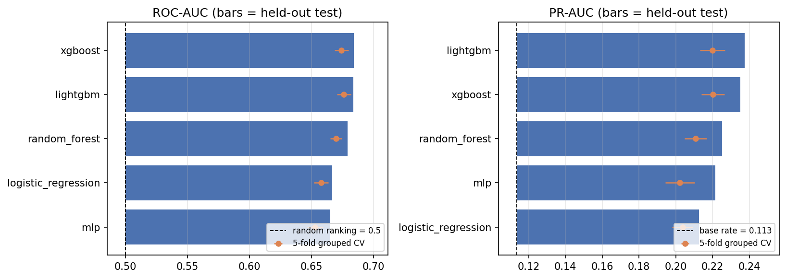

**Reading this table honestly.** LightGBM is selected, but XGBoost is inside noise
of it. This is no longer a judgement call — the paired bootstrap below measures it.
The defensible claim is *"gradient boosting beats linear and bagged models by
about 0.02 PR-AUC; the two boosters are indistinguishable."* Selection went to
LightGBM on validation PR-AUC.

### Which differences are real?

Paired cluster bootstrap on Δ PR-AUC — identical resamples for both models, so
the shared sampling noise cancels.

| comparison | Δ PR-AUC | 95% CI | resolved? |
|---|---|---|---|
| LightGBM − XGBoost | +0.0022 | [−0.0017, +0.0058] | **no — CI spans zero** |
| LightGBM − Random forest | +0.0124 | [+0.0064, +0.0189] | yes |
| LightGBM − Logistic regression | +0.0249 | [+0.0177, +0.0321] | yes |
| XGBoost − Random forest | +0.0103 | [+0.0042, +0.0167] | yes |

So: **boosting genuinely beats bagging and linear models.** Which booster wins is
not resolved by this data, and claiming otherwise would be reading noise. The
choice between them can be made on other grounds — LightGBM trains faster here
and has the better raw Brier.

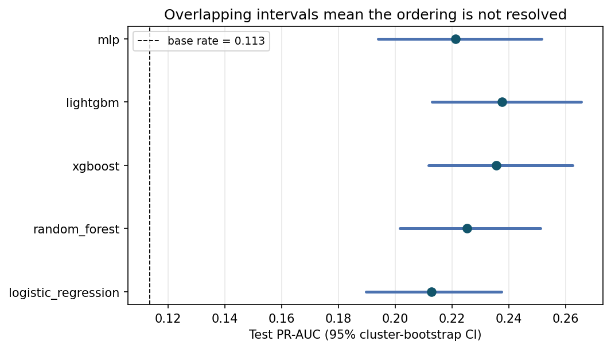

Other observations worth naming:

- **The ordering is stable across CV and test**, and test sits consistently
  ~0.01 above CV. That gap is expected — CV models train on 80% of the training
  set, the final models on all of it.
- **MLP has the best Brier (0.096) while ranking worst.** It is the only model
  trained *unweighted*, so its probabilities are undistorted. This is a clean
  demonstration that calibration and discrimination are separate properties.
- **Logistic regression reaches 0.213 PR-AUC** — 89% of the boosted result from a
  fully interpretable model. If interpretability were a hard constraint, the cost
  of that constraint is about 0.025 PR-AUC.

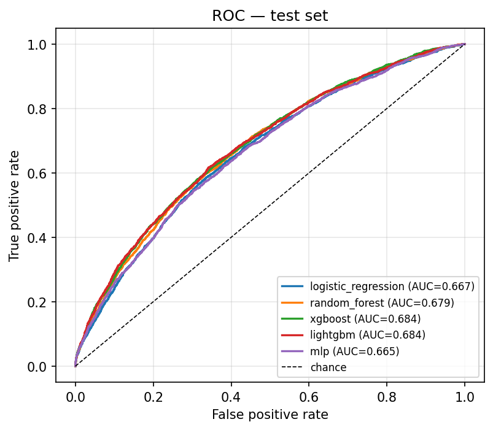
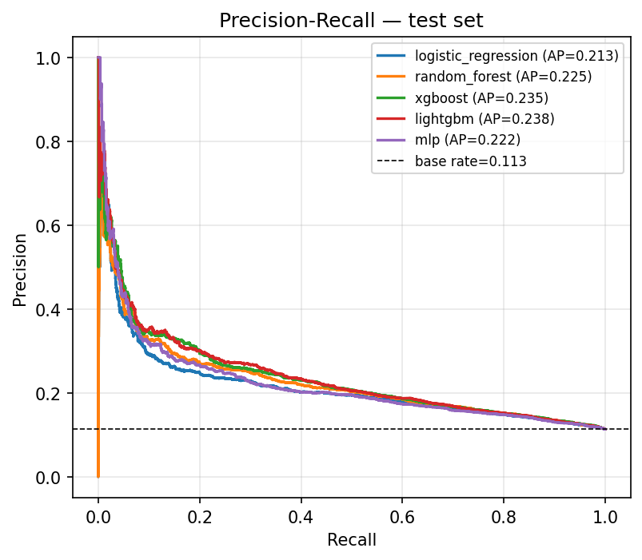

## Calibration

Class weighting is what makes ranking work and probabilities wrong. Platt scaling
fixes the probabilities without touching the ranking.

| | Brier | ROC-AUC | PR-AUC |
|---|---|---|---|
| LightGBM, raw | 0.2007 | 0.6839 | 0.2376 |
| **LightGBM + Platt** | **0.0954** | 0.6839 | 0.2376 |

Brier more than halves; discrimination is bit-identical, because a strictly
monotonic transform cannot reorder anything. Isotonic regression scored a
marginally better Brier on validation (0.0954 vs 0.0959) but cost 0.004 PR-AUC by
tying scores together, so it was rejected.

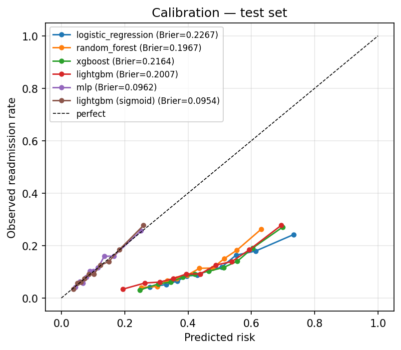

The uncalibrated curves sitting well below the diagonal are the class-weighting
distortion made visible: those models predict ~0.5 for patients who are readmitted
about 15% of the time. After calibration the curve tracks the diagonal — a
predicted 18% means roughly 18%.

## Operating point

At the deployed threshold of 0.166, flagging 19.6% of encounters:

| | flagged | not flagged |
|---|---|---|
| **Readmitted <30d** | 901 (TP) | 1,343 (FN) |
| **Not readmitted** | 2,965 (FP) | 14,564 (TN) |

Precision 23.3% · Recall 40.2% · Specificity 83.1% · F1 0.295

Read operationally: of 100 calls, ~23 reach a patient who would have been
readmitted. Against a base rate of 11.3%, the call list is worth **2.05× a random
one**.

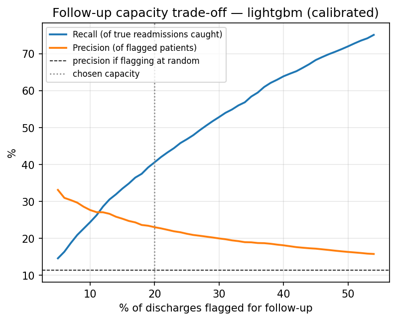

The threshold is a business decision, not a model property. The curve above prices
each option:

| capacity | recall | precision |
|---|---|---|
| 10% | 24.4% | 27.7% |
| **20%** | **40.6%** | **23.1%** |
| 30% | 52.9% | 20.0% |
| 40% | 63.9% | 18.1% |
| 50% | 72.1% | 16.4% |

(These use thresholds taken at test-set quantiles, so they differ marginally from
the 40.2% / 23.3% reported above, where the threshold is fixed on validation and
applied blind to test. The deployed figure is the honest one; this table is for
comparing capacity options against each other.)

Doubling capacity from 20% to 40% buys **23 more percentage points of recall** for
5 points of precision. Whether that trade is worth it depends on the cost of a
call versus the cost of a readmission — a hospital finance question, and the model
supports either answer without retraining.

## Ablation study

Seven variants, all scored with identical 5-fold `GroupKFold` on training
patients. The test set was not read during any of this.

| variant | features | CV PR-AUC | Δ PR-AUC | CV ROC-AUC | Δ ROC-AUC | adopted |
|---|---|---|---|---|---|---|
| **A — current** | 39 | **0.2200 ±0.0069** | — | **0.6762** | — | ✅ baseline |
| B — drop `payer_code` | 38 | 0.2180 | −0.0020 | 0.6736 | −0.0026 | ❌ |
| C — +10 engineered features | 49 | 0.2196 | −0.0005 | 0.6749 | −0.0013 | ❌ |
| D — B and C combined | 48 | 0.2178 | −0.0023 | 0.6730 | −0.0032 | ❌ |
| E — native categorical splits | 39 | 0.2194 | −0.0007 | 0.6753 | −0.0009 | ❌ |
| F — soft-vote RF+XGB+LGBM | 39 | 0.2191 | −0.0009 | 0.6760 | −0.0002 | ❌ |
| G — SMOTE not class weighting | 39 | 0.2194 | −0.0006 | 0.6740 | −0.0022 | ❌ |

**Nothing beat the baseline.** Every delta is negative and every one is smaller
than the fold-to-fold standard deviation of ±0.0069 — so the honest reading is
"no measurable difference", not "slightly worse". No variant was adopted.

Three results here are worth more than the arithmetic:

- **SMOTE (G) does not beat class weighting.** The brief names both. This settles
  it with a measurement rather than a preference, and class weighting has the
  further advantage of adding nothing to the serving path.
- **Ensembling (F) buys nothing.** The three tree models make correlated errors —
  they are reading the same limited signal, not complementary ones.
- **Dropping `payer_code` (B) costs 0.002 PR-AUC.** It is not free, so keeping it
  is a real trade rather than laziness. See [Limitations](#limitations).

Convergence of seven independent approaches on 0.22 PR-AUC is itself the finding:
**more modelling sophistication does not help here.** Reproduce with
`make experiments`.

That is a ceiling on *method*, and it is worth being precise about the
distinction — the learning curve below shows it is **not** a ceiling on *data*.

---

## Robustness

Two questions the headline number depends on but does not answer on its own.

### Does the result survive a different split?

The full pipeline — split, train, threshold from validation, evaluate — re-run
under seven seeds.

| seed | test ROC-AUC | test PR-AUC | recall @20% |
|---|---|---|---|
| **42** (reported) | **0.6839** | **0.2376** | 40.2% |
| 1 | 0.6761 | 0.2174 | 39.1% |
| 7 | 0.6675 | 0.2164 | 36.0% |
| 13 | 0.6852 | 0.2363 | 40.8% |
| 101 | 0.6819 | 0.2269 | 39.6% |
| 2024 | 0.6755 | 0.2160 | 39.4% |
| 31337 | 0.6763 | 0.2182 | 38.4% |
| **mean ± SD** | **0.678 ± 0.006** | **0.224 ± 0.010** | **39.1% ± 1.5%** |

**Seed 42 is the most favourable of the seven.** The reported PR-AUC of 0.238 sits
about 1.4 standard deviations above the mean across splits. `random_state=42` is
the conventional default and was fixed before any evaluation ran, so this is a
lucky draw rather than a selected one — but it is a lucky draw, and quoting 0.238
without this table would overstate the result.

**Use 0.678 / 0.224 as the expected performance on a new split.** The single-split
figures remain the primary reported result because they are the ones tied to the
saved model, the deployed threshold, and every other number in this document.

### Would more data help?

LightGBM trained on patient-level subsamples of the training set, scored on
validation so the test set stays untouched.

| training data | encounters | val PR-AUC | val ROC-AUC |
|---|---|---|---|
| 10% | 6,384 | 0.1734 | 0.6313 |
| 20% | 12,620 | 0.1870 | 0.6403 |
| 35% | 22,218 | 0.1985 | 0.6555 |
| 50% | 31,752 | 0.2045 | 0.6638 |
| 70% | 44,451 | 0.2102 | 0.6706 |
| 85% | 53,988 | 0.2129 | 0.6739 |
| 100% | 63,605 | 0.2151 | 0.6777 |

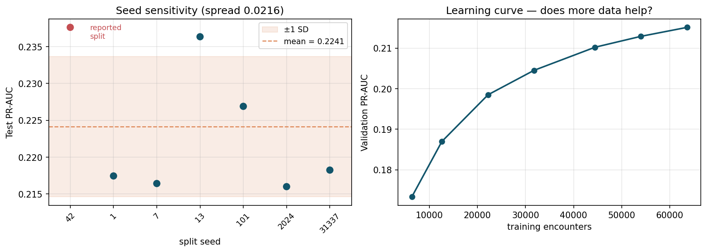

The curve is **decelerating but still rising**: the last 43% of the training data
(44k → 64k encounters) bought +0.0049 PR-AUC, and the final 15% bought +0.0022.

**This corrects an earlier overclaim.** The ablation study showed that seven
different *methods* land in the same place, and it is tempting to read that as
"we have extracted everything this data contains." The learning curve says
otherwise: extrapolating the current slope, doubling the dataset would plausibly
add roughly +0.005 PR-AUC — small, real, and not free.

The precise statement is therefore: **the ceiling is on method, not on data.**
Better algorithms will not help; more patients would, slightly. That points at a
multi-hospital dataset rather than a better booster as the next real improvement.

## What drives the predictions

Permutation importance (drop in test PR-AUC when shuffled) and SHAP agree on the
top of the list.

| rank | feature | permutation Δ PR-AUC |
|---|---|---|
| 1 | `number_inpatient` | 0.0360 |
| 2 | `discharge_group` | 0.0328 |
| 3 | `prior_encounters` | 0.0107 |
| 4 | `payer_code` | 0.0101 |
| 5 | `diag_1_group` | 0.0096 |
| 6 | `diag_3_group` | 0.0053 |
| 7 | `age_mid` | 0.0046 |

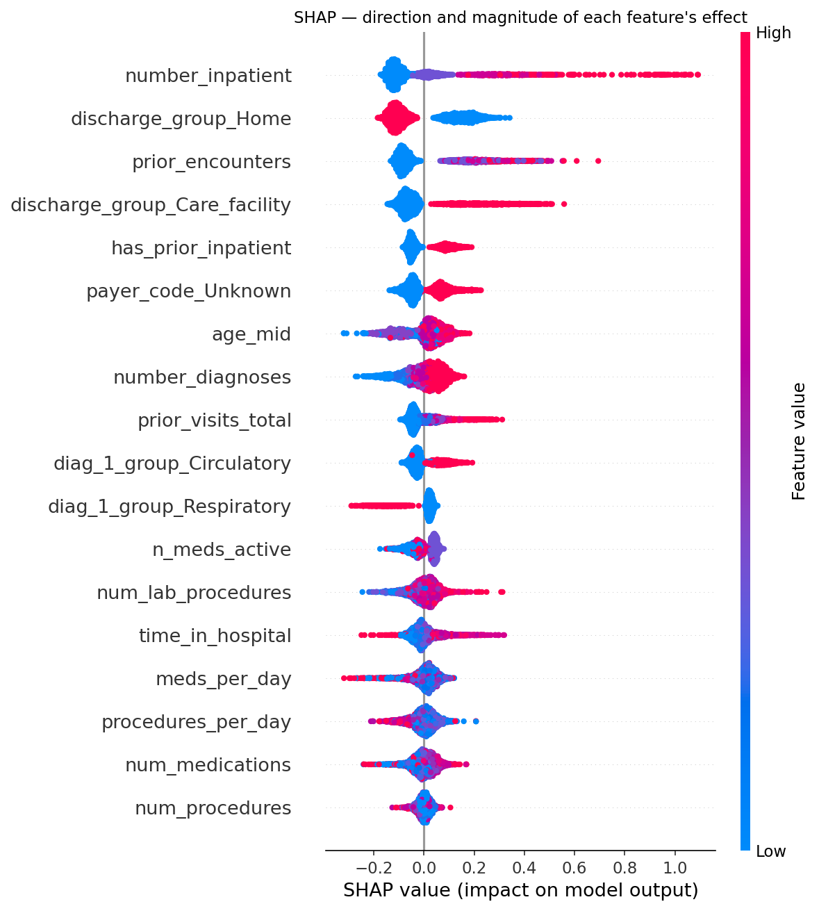

Clinically, this is the reassuring result:

- **Prior inpatient admissions dominate.** Patients who have been admitted before
  are readmitted again. Utilisation history beats anything measured during the
  stay.
- **Where the patient goes matters.** Discharge to home lowers risk; discharge to
  a care facility raises it — a proxy for frailty and dependency.
- **Primary diagnosis matters, circulatory most.** Heart failure and related
  conditions push risk up; respiratory pushes it down.
- **Nothing suspicious sits at the top.** No identifier, no date artefact — which
  is what you want to see after closing three leakage paths.

`reports/example_reason_codes.csv` shows the per-patient form the ward would
receive:

> Risk 0.43 — `number_inpatient=16` (+0.996); `prior_encounters=22` (+0.401);
> `prior_visits_total=19` (+0.261)

## Fairness

Per-subgroup performance at the deployed threshold
([`reports/fairness_report.csv`](../reports/fairness_report.csv)). Groups under
200 test encounters are suppressed.

### By race

| group | n | base rate | flag rate | recall | precision | ROC-AUC |
|---|---|---|---|---|---|---|
| Caucasian | 14,813 | 11.7% | 19.8% | 40.4% | 23.9% | 0.684 |
| African American | 3,697 | 10.8% | 20.2% | 40.1% | 21.4% | 0.670 |
| Hispanic | 398 | 9.1% | 16.8% | 47.2% | 25.4% | 0.801 |
| Other | 302 | 10.3% | 12.9% | 32.3% | 25.6% | 0.684 |
| Unknown | 447 | 7.2% | 14.1% | 31.3% | 15.9% | 0.658 |

### By gender

| group | n | base rate | flag rate | recall | precision | ROC-AUC |
|---|---|---|---|---|---|---|
| Female | 10,726 | 11.4% | 20.1% | 42.4% | 24.2% | 0.694 |
| Male | 9,047 | 11.2% | 19.0% | 37.5% | 22.2% | 0.673 |

### By age

| group | n | base rate | flag rate | recall | precision | ROC-AUC |
|---|---|---|---|---|---|---|
| <40 | 1,289 | 12.2% | 20.2% | 58.0% | 34.9% | 0.784 |
| 40–60 | 5,376 | 10.4% | 14.8% | 39.6% | 27.9% | 0.712 |
| 60–80 | 9,277 | 11.4% | 20.8% | 39.7% | 21.8% | 0.673 |
| **80+** | **3,831** | **12.2%** | **23.0%** | **35.8%** | **19.0%** | **0.613** |

**The finding that matters is age, not race.** Race and gender gaps are modest —
the two large racial groups get near-identical flag rates and recall.

The over-80 group is the problem. It has the **highest flag rate (23.0%)**, the
**lowest precision (19.0%)**, the **lowest recall (35.8%)**, and by far the
**worst discrimination (ROC-AUC 0.613)**. The model flags the most elderly
patients while ranking them worst — it is spending disproportionate follow-up
capacity on the group where its ordering is least trustworthy. Since almost
everything the model relies on is a proxy for frailty, and nearly all patients
over 80 look frail, the features stop separating within that group.

**This would have to be addressed before deployment.** The obvious fix is an
age-stratified threshold, so we tried it and measured the result.

### Does an age-stratified threshold fix it?

One capacity threshold per age band, each fitted on validation, so every band
flags 20% of its own members instead of sharing a global cutoff.

| policy | flagged | recall | precision | true positives |
|---|---|---|---|---|
| Global threshold | 19.6% | 40.2% | 23.3% | 901 |
| Age-stratified | 19.9% | 39.7% | 22.7% | 891 |

Per band:

| band | flag rate (global → stratified) | recall (global → stratified) |
|---|---|---|
| <40 | 20.3% → 23.1% | 58.0% → 60.5% |
| 40–60 | 14.8% → 20.6% | 39.6% → 46.1% |
| 60–80 | 20.8% → 19.4% | 39.7% → 37.6% |
| **80+** | **23.0% → 19.0%** | **35.8% → 30.0%** |

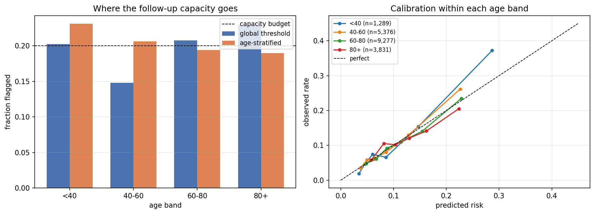

**It does not fix the problem, and the reason is instructive.** Thresholds move
capacity around; they cannot change ranking. The 80+ ROC-AUC is 0.613 under both
policies, because it is the same model scoring the same patients. What
stratifying actually does is take follow-up calls *away* from patients over 80
and give them to patients aged 40–60, where the model discriminates better.

Total cost: 10 true positives out of 901 — about 1%.

**Whether that is an improvement is a value judgement, not a metric.** Patients
over 80 have the *highest* base rate in the dataset (12.2%), so a policy that
calls fewer of them is not obviously fair, even though it equalises exposure. The
global threshold gives the highest-risk group the most attention; the stratified
one gives every group equal attention. Those encode different definitions of
fairness, and choosing between them is a hospital's decision.

What is not a value judgement: **the underlying problem is discrimination, not
calibration, and no threshold policy can repair it.** A real fix has to be
upstream — features that separate frailty *within* an elderly population, or a
model fitted specifically for that group.

### Can the oldest patients be predicted better at all?

Thresholds failed, so the next question is whether the *ranking* can be improved.
Diagnose before prescribing: is the signal missing from the data, or is the model
failing to use it?

**Univariate AUC of each feature, within each band.** This is model-free — it asks
how well a single raw number separates outcomes among patients of that age.

| feature | <40 | 40-60 | 60-80 | 80+ |
|---|---|---|---|---|
| `number_inpatient` | 0.710 | 0.635 | 0.592 | 0.574 |
| `prior_visits_total` | 0.709 | 0.631 | 0.588 | 0.573 |
| `has_prior_inpatient` | 0.683 | 0.618 | 0.579 | 0.564 |
| `prior_encounters` | 0.669 | 0.624 | 0.577 | 0.566 |
| `number_emergency` | 0.605 | 0.546 | 0.525 | 0.517 |
| `number_diagnoses` | 0.587 | 0.574 | 0.537 | **0.509** |
| **mean \|AUC − 0.5\| over all features** | **0.075** | **0.053** | **0.035** | **0.027** |

**The signal decays monotonically with age, feature by feature.** Prior inpatient
admissions — the single strongest predictor overall — falls from 0.710 to 0.574.
`number_diagnoses` reaches 0.509, which is indistinguishable from noise. Averaged
across every numeric feature, an 80+ patient carries roughly **a third** of the
separable signal a under-40 patient does.

This confirms the frailty-saturation hypothesis with a measurement rather than an
assertion: these features work by identifying patients who look sick and heavily
used the system, and among the over-80s almost everyone does.

**Three fixes, all measured, all rejected.** Selection on validation; the 80+ test
slice is 3,831 encounters.

| approach | val ROC-AUC (80+) | test ROC-AUC (80+) | overall test ROC-AUC |
|---|---|---|---|
| **Global model (current)** | **0.6343** | **0.6134** | **0.6839** |
| Dedicated 80+ model | 0.6026 | 0.5876 | — |
| Sample weight ×3 on 80+ | 0.6288 | 0.6087 | 0.6817 |
| Sample weight ×6 on 80+ | 0.6189 | 0.6003 | 0.6750 |

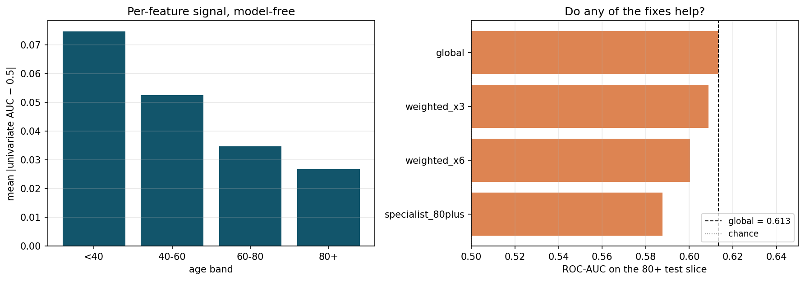

Nothing beats the global model, and the failures are informative:

- **A dedicated model is the worst option** (0.588). Trained on 12,122 rows
  instead of 63,605, it loses more to variance than it gains from specialisation.
  The general model's exposure to younger patients is *helping* it rank older
  ones — the relationships transfer even as their strength decays.
- **Upweighting makes both groups worse.** Pushing the loss toward the 80+ band
  degrades overall ROC-AUC (0.6839 → 0.6750 at ×6) *and* fails to improve the
  band it was meant to help. There is nothing extra to learn; the optimiser just
  overfits noise in that slice.

**Conclusion: the ceiling for the oldest patients is a data limit, not a
modelling one.** No reweighting, specialisation, or threshold policy recovers
signal that is not in the columns. Fixing it needs variables this dataset does
not contain — functional status, frailty index, cognitive status, social support
at home, prior falls — which is precisely the information geriatric readmission
research says matters and administrative billing data omits.

One further explanation we cannot test here: **competing risk.** A patient
discharged alive who dies at home within 30 days is recorded as "not readmitted".
That misclassification is concentrated in the oldest band by construction, and it
would depress measurable discrimination exactly where we observe it. The dataset
has no post-discharge mortality, so this stays a hypothesis — but a well-founded
one.

Reproduce with `make subgroup`.

### Calibration within subgroups

Discrimination is only half the fairness question. For a tool whose output is a
probability, whether "18%" means 18% *for this patient's group* matters as much.

| attribute | group | n | observed | predicted | ratio | slope | Brier |
|---|---|---|---|---|---|---|---|
| gender | Female | 10,726 | 11.45% | 11.44% | 1.00 | 1.12 | 0.096 |
| gender | Male | 9,047 | 11.23% | 11.14% | 0.99 | 0.98 | 0.095 |
| race | Caucasian | 14,813 | 11.72% | 11.39% | 0.97 | 1.07 | 0.098 |
| race | African American | 3,697 | 10.79% | 11.39% | 1.06 | 0.94 | 0.093 |
| race | Hispanic | 398 | 9.05% | 10.52% | 1.16 | 1.67 | 0.074 |
| race | Unknown | 447 | 7.16% | 9.61% | **1.34** | 0.86 | 0.066 |
| age | 40–60 | 5,376 | 10.42% | 9.83% | 0.94 | 1.12 | 0.086 |
| age | 60–80 | 9,277 | 11.43% | 11.65% | 1.02 | 1.04 | 0.097 |
| age | **80+** | 3,831 | 12.19% | 12.63% | 1.04 | **0.79** | **0.105** |
| age | <40 | 1,289 | 12.18% | 10.98% | 0.90 | 1.28 | 0.092 |

*Ratio* = predicted mean ÷ observed rate (1.0 is ideal; >1 overstates risk).
*Slope* = logistic fit of outcome on the logit of prediction (1.0 is ideal; <1
means predictions are spread too wide for that group).

**Calibration is good where it matters most.** Gender is near-perfect (1.00,
0.99), and the two large racial groups are within 6% (0.97, 1.06). Nothing here
suggests the risk score systematically misleads on race or sex.

Two flags:

- **`race = Unknown` overstates risk by 34%.** Small group (n=447) so the estimate
  is noisy, but it is consistent with `payer_code_Unknown` being a top-6 driver —
  the model appears to treat administrative missingness as a risk signal harder
  than the outcomes justify.
- **Patients 80+ have a calibration slope of 0.79 and the worst Brier (0.105).**
  Predictions for this group are spread too wide: the model is over-confident at
  both ends. This corroborates the discrimination finding from a completely
  independent angle, which is the strongest form the evidence could take.

---

## Is the model worth using at all?

Discrimination says the ranking is good. It does not say that acting on the
ranking beats what a hospital already does. Decision curve analysis (Vickers &
Elkin) prices that directly.

    net benefit = TP/N − (FP/N) × pt/(1 − pt)

`pt` is the threshold probability — the risk at which a call becomes worthwhile.
It encodes the exchange rate: at `pt`, you accept `(1 − pt)/pt` unnecessary calls
to catch one readmission. Sweeping `pt` prices every cost assumption at once,
which is what lets us report this without inventing a rupee figure.

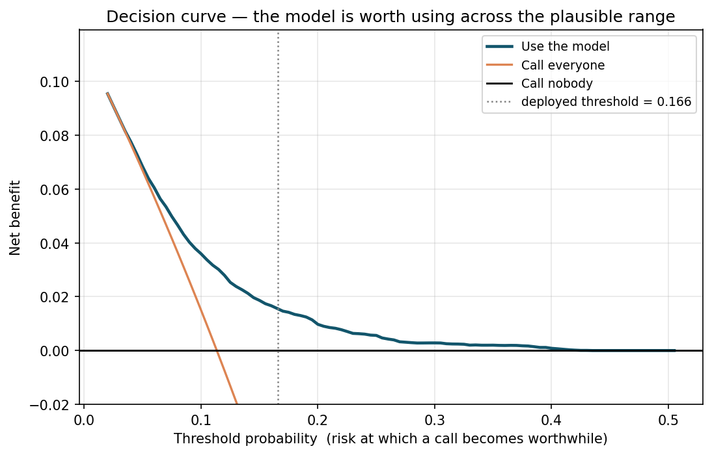

**The model beats both alternatives for `pt` between 0.025 and 0.43** — that is,
anywhere from "I'd make 39 wasted calls to catch one readmission" to "I'd make
1.3". Every realistic hospital sits inside that range, so the conclusion does not
depend on knowing the exact costs.

At the deployed threshold (`pt` ≈ 0.166):

| policy | net benefit |
|---|---|
| **Use the model** | **+0.0157** |
| Call everyone | −0.0617 |
| Call nobody | 0.0000 |

Interpreted: **15.6 additional readmissions caught per 1,000 discharges**, net of
the false alarms they cost. Calling everyone is *worse than doing nothing* at this
exchange rate — the false-alarm burden swamps the benefit — which is precisely
the situation a triage model exists to fix.

---

## Uncertainty

Every interval in this document comes from a **cluster bootstrap**: 2,000
resamples of the held-out test set, drawing *patients* with replacement and
taking all of their encounters.

Resampling rows would understate the intervals for the same reason a row-level
train/test split overstates performance — encounters from one patient are
correlated, so treating them as independent draws makes the sample look larger
than it is.

Reproduce with `make uncertainty`; raw output in
[`reports/bootstrap_ci.json`](../reports/bootstrap_ci.json).

## Limitations

**1. Discrimination is modest, and no method we tried moves it.** ROC-AUC 0.684
on the reported split (0.678 ± 0.006 across seeds) sits in the 0.64–0.70 band
published for this dataset and target. Seven approaches converged on it. A
materially higher number on this data almost always indicates a leaked split
rather than a better model. Note the qualifier: the learning curve shows *more
data* would still help slightly, so this is a limit of method and sample size,
not a hard information-theoretic bound.

**1b. The reported split is the most favourable of seven tested.** Expected
performance on a fresh split is PR-AUC 0.224 ± 0.010, against the 0.238 quoted
in the headline. The seed was fixed before any evaluation ran, so this is luck
rather than selection — but it is reported rather than buried.

**2. `payer_code_Unknown` is a top-6 driver.** Insurance coding is not
physiology — it is very likely a proxy for hospital, era, or documentation
practice. It generalises within this dataset and may not generalise to a new
hospital. Removing it costs 0.002 PR-AUC (ablation B), so it is retained
knowingly, and it is the first thing to re-examine on local data.

**3. The data is 1999–2008.** Coding standards, drug availability, and discharge
policy have all changed. Recalibration on recent local data is mandatory, not
optional.

**4. Diabetic inpatients only, 1–14 day stays.** The model does not transfer to
general medical populations without revalidation.

**4b. The oldest patients cannot be ranked well, and the cause is the data.**
ROC-AUC 0.613 for the 80+ band. Every feature's univariate signal decays
monotonically with age, and a dedicated model, sample weighting, and stratified
thresholds all fail to beat the global model. Closing this needs frailty index,
functional status, cognition, and social support — variables administrative
billing data omits. Until then the tool should not be relied on for this group.

**5. 59.8% of readmissions are missed at 20% capacity.** This tool reprioritises
attention. It does not identify every at-risk patient, and an unflagged patient
is not a safe patient.

**6. Readmissions to other hospitals are invisible.** The dataset records only
returns within the same network, so the true positive rate is understated and
the model is trained on an incomplete label.

## Reproducibility

Every number above regenerates from a clean clone:

```bash
make setup && make data && make tune && make train && make experiments && make explain && make evidence && make test
```

`make evidence` runs the five analyses added after the model was frozen —
bootstrap intervals, seed sweep and learning curve, equity, the decision curve,
and the oldest-band diagnosis. None of them changed the model; three of them
corrected claims made about it: the learning curve falsified the
"information ceiling of the data" wording, the seed sweep showed the reported
split is the most favourable of seven, and the subgroup diagnosis exposed a
mislabelled age band.

Fixed seed (42) throughout. Runtime: ~60 s for `train`, ~5 min for `tune`, ~2 min
for `experiments`. 27 tests cover ICD-9 grouping, label construction, all three
leakage paths, split determinism, feature consistency, age-band labelling, the
serving path, and the statistics added afterwards — that the bootstrap resamples whole patients rather
than rows, and that the net-benefit formula behaves correctly at its known
boundary cases.
